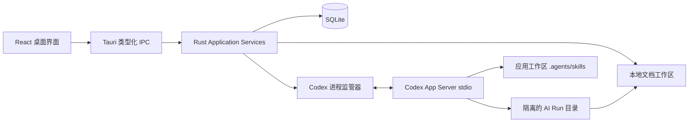
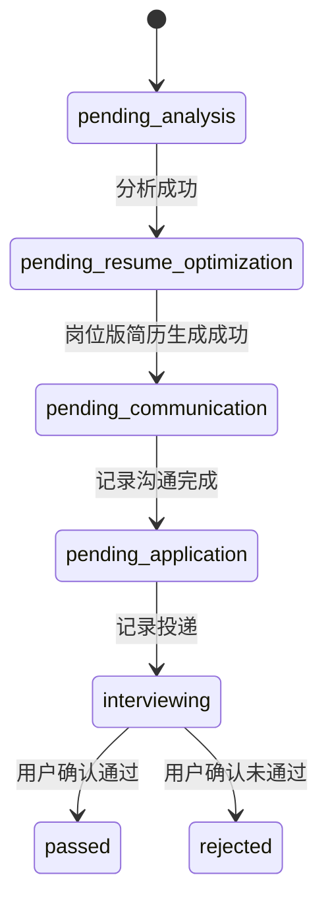

# 个人求职工作台技术实现方案

## 1 文档目的

本文档是项目的工程实施依据，面向后续 coding agent 和代码审查者。实现者应按本文定义的架构边界、数据模型、文件协议、状态流转和验收标准工作。未在本文中定义的扩展功能不得加入首版。

项目首版是 macOS 优先的本地单用户桌面应用。它管理岗位、投递流程、面试轮次、Markdown 简历和视觉模板，并通过本机 Codex App Server 完成 JD 分析、公司调研和岗位定向简历生成。

## 2 已确认的产品决策

| 项目 | 决策 |
| --- | --- |
| 客户端 | Tauri 2 桌面应用 |
| 首发平台 | macOS arm64 和 x86_64 |
| 数据范围 | 纯本地、单用户、无账号、无云同步 |
| AI 接入 | 本机 `codex app-server`，stdio JSONL |
| AI 登录 | ChatGPT 登录或 OpenAI API Key，由 Codex 管理凭据 |
| 简历源格式 | Markdown 是唯一可信源；HTML 只用于预览，PDF 只用于导出 |
| AI 改写 | 每次生成完整岗位版副本，不覆盖原始简历 |
| 公司分析 | JD 分析加公开网络调研，结果保留来源 |
| 岗位流转 | 系统引导下一步，但允许用户手动跳转和回退 |
| HR 无回应 | 完全手动标记为未通过，不做超时自动流转 |
| 自定义模板 | 无脚本 HTML/CSS ZIP 模板包 |
| Magic Resume | 只参考 `JOYCEQL/magic-resume` 的产品行为，不复制其代码、模板或品牌资产 |

## 3 范围

### 3.1 首版必须实现

- 求职进度看板、岗位库和岗位详情。
- JD 上传、粘贴、编辑及原文保留。
- JD 分析和公司联网调研。
- Markdown 简历上传、编辑、版本管理、HTML 预览和 PDF 导出。
- 基于基础简历和 JD 生成完整岗位版简历。
- 沟通记录、投递记录和可变面试轮次。
- Codex CLI 检测、App Server 生命周期、登录、Skill 发现、AI 任务队列及运行记录。
- 本地备份和恢复。
- 三套独立实现的内置简历模板。

### 3.2 首版明确不实现

- 账号、云同步、多人协作和移动端。
- 招聘网站抓取、自动投递和邮箱读取。
- 根据等待时间自动判定 HR 无回应。
- DOCX、PDF 简历导入。
- AI 模拟面试、语音面试和面试评分。
- 将 App Server 以 WebSocket 方式暴露到公网。
- 复制或改造 `JOYCEQL/magic-resume` 的受限源代码。

## 4 总体架构



### 4.1 技术栈

| 层 | 技术与约束 |
| --- | --- |
| 桌面宿主 | Tauri 2、Rust stable、Tokio |
| 前端 | React 19、TypeScript 5、Vite |
| 路由 | TanStack Router |
| UI | shadcn/ui、Radix、Tailwind CSS 4、Lucide |
| 客户端状态 | Zustand，只保存短期界面状态，不作为业务数据源 |
| 数据获取 | TanStack Query，所有持久化操作通过 Tauri IPC |
| 数据库 | SQLite、SQLx、显式 SQL migrations |
| 类型同步 | Serde、Specta、tauri-specta 生成 TypeScript IPC 类型 |
| Markdown | unified、remark-parse、remark-gfm、remark-rehype、rehype-sanitize |
| 编辑器 | CodeMirror 6 Markdown 模式 |
| 模板 | Handlebars strict mode、PostCSS parser、DOMPurify/rehype-sanitize |
| 拖拽 | dnd-kit |
| 测试 | Vitest、React Testing Library、Playwright、Rust unit/integration tests |

### 4.2 仓库结构

```text
job-search-workbench/
├── apps/
│   └── desktop/
│       ├── src/                       # React UI
│       ├── src-tauri/
│       │   ├── src/
│       │   │   ├── commands/          # IPC commands
│       │   │   ├── application/       # 用例服务
│       │   │   ├── domain/            # Rust 领域类型
│       │   │   ├── infrastructure/    # SQLite、文件、App Server、PDF
│       │   │   └── main.rs
│       │   └── migrations/
│       └── e2e/
├── packages/
│   ├── domain/                        # TS 类型、Zod schema、状态机
│   ├── markdown-resume/               # Markdown AST、HTML 渲染、版本迁移
│   ├── template-engine/               # 模板校验与渲染
│   ├── app-server-protocol/            # 生成的协议类型和客户端封装
│   └── ui/                            # shadcn 组件和设计 tokens
├── .agents/
│   └── skills/
│       ├── job-jd-analyzer/
│       ├── company-researcher/
│       └── resume-tailor/
├── docs/
│   ├── architecture/
│   └── adr/
├── pnpm-workspace.yaml
├── Cargo.toml
└── LICENSE
```

采用 pnpm workspace。Rust workspace 只包含 Tauri 宿主及必要的内部 crate，不引入 Node sidecar。

### 4.3 运行时数据目录

使用 Tauri `app_data_dir`，不得在安装目录或源码仓库内写用户数据。

```text
<app_data_dir>/
├── app.db
├── workspace/
│   ├── .agents/skills/                # 当前生效的内置和用户 Skill
│   ├── jobs/<job-id>/
│   │   ├── jd.md
│   │   ├── analysis/
│   │   └── ai-runs/<run-id>/
│   └── resumes/<resume-id>/resume.md
├── templates/<template-id>/
├── backups/
└── logs/
```

数据库中的所有路径必须是相对 `app_data_dir` 的 POSIX 风格相对路径。业务表禁止保存绝对路径。

## 5 领域模型与数据库

### 5.1 状态枚举

```ts
export type JobStatus =
  | "pending_analysis"
  | "pending_resume_optimization"
  | "pending_communication"
  | "pending_application"
  | "interviewing"
  | "passed"
  | "rejected";

export type AIRunType =
  | "job_analysis"
  | "company_research"
  | "resume_tailoring";

export type AIRunStatus =
  | "queued"
  | "running"
  | "waiting_approval"
  | "succeeded"
  | "failed"
  | "cancelled";

export type InterviewRoundStatus =
  | "planned"
  | "scheduled"
  | "completed"
  | "cancelled";
```

### 5.2 SQLite schema

首个 migration 命名为 `0001_initial.sql`。时间统一保存为 UTC RFC3339 字符串，ID 统一使用 UUID v7。必须启用 `PRAGMA foreign_keys = ON` 和 WAL。

```sql
CREATE TABLE jobs (
  id TEXT PRIMARY KEY,
  company_name TEXT NOT NULL CHECK(length(trim(company_name)) > 0),
  role_title TEXT NOT NULL DEFAULT '',
  status TEXT NOT NULL CHECK(status IN (
    'pending_analysis',
    'pending_resume_optimization',
    'pending_communication',
    'pending_application',
    'interviewing',
    'passed',
    'rejected'
  )),
  jd_path TEXT NOT NULL,
  source_url TEXT,
  location TEXT,
  salary_text TEXT,
  active_resume_id TEXT,
  terminal_reason TEXT,
  created_at TEXT NOT NULL,
  updated_at TEXT NOT NULL,
  FOREIGN KEY(active_resume_id) REFERENCES resumes(id) ON DELETE SET NULL
);

CREATE TABLE resumes (
  id TEXT PRIMARY KEY,
  title TEXT NOT NULL,
  kind TEXT NOT NULL CHECK(kind IN ('base', 'tailored')),
  markdown_path TEXT NOT NULL UNIQUE,
  parent_resume_id TEXT,
  job_id TEXT,
  template_id TEXT NOT NULL,
  content_sha256 TEXT NOT NULL,
  schema_version INTEGER NOT NULL DEFAULT 1,
  created_at TEXT NOT NULL,
  updated_at TEXT NOT NULL,
  FOREIGN KEY(parent_resume_id) REFERENCES resumes(id) ON DELETE SET NULL,
  FOREIGN KEY(job_id) REFERENCES jobs(id) ON DELETE SET NULL
);

CREATE TABLE job_events (
  id TEXT PRIMARY KEY,
  job_id TEXT NOT NULL,
  event_type TEXT NOT NULL,
  from_status TEXT,
  to_status TEXT,
  actor TEXT NOT NULL CHECK(actor IN ('user', 'system', 'ai')),
  payload_json TEXT NOT NULL DEFAULT '{}',
  occurred_at TEXT NOT NULL,
  FOREIGN KEY(job_id) REFERENCES jobs(id) ON DELETE CASCADE
);

CREATE TABLE communications (
  id TEXT PRIMARY KEY,
  job_id TEXT NOT NULL,
  occurred_at TEXT NOT NULL,
  contact_name TEXT,
  channel TEXT NOT NULL CHECK(channel IN (
    'phone', 'email', 'wechat', 'linkedin', 'meeting', 'other'
  )),
  notes TEXT NOT NULL DEFAULT '',
  created_at TEXT NOT NULL,
  FOREIGN KEY(job_id) REFERENCES jobs(id) ON DELETE CASCADE
);

CREATE TABLE applications (
  id TEXT PRIMARY KEY,
  job_id TEXT NOT NULL,
  applied_at TEXT NOT NULL,
  channel TEXT NOT NULL DEFAULT 'other',
  notes TEXT NOT NULL DEFAULT '',
  created_at TEXT NOT NULL,
  FOREIGN KEY(job_id) REFERENCES jobs(id) ON DELETE CASCADE
);

CREATE TABLE interview_rounds (
  id TEXT PRIMARY KEY,
  job_id TEXT NOT NULL,
  sequence INTEGER NOT NULL,
  name TEXT NOT NULL,
  status TEXT NOT NULL CHECK(status IN (
    'planned', 'scheduled', 'completed', 'cancelled'
  )),
  scheduled_at TEXT,
  format TEXT,
  interviewer TEXT,
  notes TEXT NOT NULL DEFAULT '',
  result TEXT CHECK(result IN ('passed', 'failed', 'pending') OR result IS NULL),
  created_at TEXT NOT NULL,
  updated_at TEXT NOT NULL,
  UNIQUE(job_id, sequence),
  FOREIGN KEY(job_id) REFERENCES jobs(id) ON DELETE CASCADE
);

CREATE TABLE templates (
  id TEXT PRIMARY KEY,
  name TEXT NOT NULL,
  origin TEXT NOT NULL CHECK(origin IN ('builtin', 'uploaded')),
  version TEXT NOT NULL,
  manifest_path TEXT NOT NULL UNIQUE,
  preview_path TEXT,
  enabled INTEGER NOT NULL DEFAULT 1,
  created_at TEXT NOT NULL,
  updated_at TEXT NOT NULL
);

CREATE TABLE ai_runs (
  id TEXT PRIMARY KEY,
  job_id TEXT,
  resume_id TEXT,
  run_type TEXT NOT NULL CHECK(run_type IN (
    'job_analysis', 'company_research', 'resume_tailoring'
  )),
  status TEXT NOT NULL CHECK(status IN (
    'queued', 'running', 'waiting_approval',
    'succeeded', 'failed', 'cancelled'
  )),
  thread_id TEXT,
  model TEXT,
  skill_snapshot_json TEXT NOT NULL,
  input_manifest_json TEXT NOT NULL,
  output_manifest_json TEXT,
  workdir_path TEXT NOT NULL,
  error_code TEXT,
  error_message TEXT,
  queued_at TEXT NOT NULL,
  started_at TEXT,
  finished_at TEXT,
  FOREIGN KEY(job_id) REFERENCES jobs(id) ON DELETE SET NULL,
  FOREIGN KEY(resume_id) REFERENCES resumes(id) ON DELETE SET NULL
);

CREATE TABLE artifacts (
  id TEXT PRIMARY KEY,
  job_id TEXT,
  resume_id TEXT,
  ai_run_id TEXT,
  kind TEXT NOT NULL,
  relative_path TEXT NOT NULL UNIQUE,
  sha256 TEXT NOT NULL,
  metadata_json TEXT NOT NULL DEFAULT '{}',
  created_at TEXT NOT NULL,
  FOREIGN KEY(job_id) REFERENCES jobs(id) ON DELETE SET NULL,
  FOREIGN KEY(resume_id) REFERENCES resumes(id) ON DELETE CASCADE,
  FOREIGN KEY(ai_run_id) REFERENCES ai_runs(id) ON DELETE SET NULL
);

CREATE INDEX idx_jobs_status_updated ON jobs(status, updated_at DESC);
CREATE INDEX idx_job_events_job_time ON job_events(job_id, occurred_at DESC);
CREATE INDEX idx_interviews_job_sequence ON interview_rounds(job_id, sequence);
CREATE INDEX idx_ai_runs_status_queue ON ai_runs(status, queued_at);
```

SQLite 不负责业务状态机。所有写入必须经过 Rust application service，禁止前端直接执行 SQL。

## 6 岗位状态机



### 6.1 自动流转规则

| 业务动作 | 成功后的目标状态 |
| --- | --- |
| 新建岗位 | `pending_analysis` |
| JD 与公司分析均校验成功 | `pending_resume_optimization` |
| 岗位版简历保存成功 | `pending_communication` |
| 用户记录一次沟通并选择“进入待投递” | `pending_application` |
| 用户记录投递动作 | `interviewing` |
| 用户确认最终通过 | `passed` |
| 用户确认未通过或无回应 | `rejected` |

### 6.2 手动流转规则

- 用户可以从任意非终态跳到任意状态，也可以从终态恢复。
- 跨过一个或多个阶段时显示确认对话框。
- 流转到 `passed` 或 `rejected` 时允许填写原因，但原因不是必填。
- 每次变化必须与 `jobs.status` 更新放在同一事务中，并追加一条 `job_events`。
- AI 任务失败、取消或输出校验失败时不得改变岗位状态。

## 7 Markdown 简历协议

### 7.1 文件格式

```markdown
---
schemaVersion: 1
title: 张三 产品经理简历
locale: zh-CN
templateId: builtin.classic
---

<!-- resume-section id="basic" -->
## 基本信息

# 张三

产品经理

- 邮箱：name@example.com
- 电话：13800000000

<!-- resume-section id="experience" -->
## 工作经历

### 示例科技｜高级产品经理

2022.03 - 至今

- 负责具体业务，结果提升 20%。

<!-- resume-section id="projects" -->
## 项目经历

<!-- resume-section id="education" -->
## 教育经历

<!-- resume-section id="skills" -->
## 技能
```

### 7.2 解析规则

- Frontmatter 必须存在，`schemaVersion` 当前只接受整数 `1`。
- 必须存在 `basic`、`experience`、`projects`、`education`、`skills` 五个系统 section ID；内容可以为空。
- 同一 section ID 不得重复。未知 ID 作为自定义章节保留。
- section 的可见标题可以修改；系统依赖 HTML comment 中的 ID，不依赖中文标题。
- Markdown 正文采用 GFM，允许表格、列表、链接、强调和本地图片。
- 禁止原始 `<script>`、`<iframe>`、`<object>`、`<embed>`、表单及事件属性。
- 保存前执行 AST 解析和 schema 校验。校验失败时保留编辑缓冲区，但不覆盖磁盘上的最后有效版本。
- 文件写入采用同目录临时文件、`fsync`、rename；成功后更新数据库哈希。

### 7.3 版本规则

- 上传原始 Markdown 创建 `kind=base` 的新简历。
- AI 优化时，先把基础简历复制到 AI Run 临时目录，AI 只能修改副本。
- 输出校验成功后创建新的 `kind=tailored` 记录，设置 `parent_resume_id` 和 `job_id`。
- 人工编辑更新同一简历文件，不额外创建数据库版本；每次保存前保留最近 30 个本地快照。
- 用户点击“另存为版本”时创建新的 `ResumeDocument`，父节点指向当前简历。
- 删除基础简历不得级联删除岗位版简历；数据库外键使用 `SET NULL`。

### 7.4 导入归一化

- 用户上传普通 `.md` 文件时，不要求原文件已经包含 Frontmatter 或 section comment。
- 导入器先解析标题结构，再按“基本信息、个人信息、工作经历、项目经历、教育经历、技能”等中英文别名尝试映射系统 section。
- 导入预览必须展示自动映射结果；未识别的章节作为自定义章节，缺失的系统章节以空内容补齐。
- 用户确认后，应用复制原文件并生成符合本协议的新文件。不得原地修改用户选择的源文件。
- 同一导入操作保存原始文件 SHA-256 和归一化警告，便于后续排查解析差异。

## 8 视觉模板协议

### 8.1 ZIP 结构

```text
template.zip
├── manifest.json
├── template.html
├── style.css
└── assets/
    ├── avatar-placeholder.webp
    └── custom-font.woff2
```

`manifest.json`：

```json
{
  "schemaVersion": 1,
  "id": "author.template-name",
  "name": "模板名称",
  "author": "作者",
  "version": "1.0.0",
  "entry": "template.html",
  "style": "style.css",
  "supportedLocales": ["zh-CN", "en-US"],
  "page": {
    "size": "A4",
    "marginMm": [12, 12, 12, 12]
  }
}
```

### 8.2 模板上下文

```ts
export interface TemplateContextV1 {
  document: {
    title: string;
    locale: string;
  };
  resume: {
    bodyHtml: string;
  };
  sections: Record<string, {
    title: string;
    html: string;
  }>;
}
```

模板使用 Handlebars strict mode。允许 `{{document.title}}`、`{{resume.bodyHtml}}` 和 `{{sections.experience.html}}` 等固定字段；不允许自定义 helper、运行代码或读取文件系统。

### 8.3 安全校验

- 解压前检查总大小不超过 10MB、文件数不超过 100、单文件不超过 5MB。
- 拒绝绝对路径、`..`、符号链接和重复规范化路径。
- 资产只允许 PNG、JPEG、WebP、WOFF、WOFF2；拒绝 SVG、HTML 资产和可执行文件。
- HTML 删除脚本、iframe、表单、事件处理器、meta refresh 和远程 URL。
- CSS 使用 AST 检查，拒绝 `@import`、远程 URL、`javascript:`、`expression()` 和非 `assets/` 路径。
- 预览 iframe 不设置 `allow-scripts`，并使用 CSP：`default-src 'none'; img-src data: jobdesk-template:; style-src 'unsafe-inline' jobdesk-template:; font-src jobdesk-template:`。
- 导入成功后生成静态预览图；校验失败不得在模板列表中创建记录。

## 9 PDF 导出

定义平台适配接口：

```ts
export interface PdfExportRequest {
  resumeId: string;
  templateId: string;
  outputPath: string;
}

export interface PdfExportResult {
  outputPath: string;
  pageCount: number;
  sha256: string;
}
```

- 首版 macOS 使用隐藏 WKWebView 加载最终 HTML，通过 `WKWebView.createPDF` 生成 PDF 数据。
- CSS 使用 `@page { size: A4; }`，页边距取模板 manifest。
- 导出前等待 `document.fonts.ready` 和所有本地图片完成加载。
- 10 秒未完成视为失败，不保留不完整文件。
- 导出的 PDF 必须保留可选择文字和可点击链接，禁止使用全页截图转 PDF。
- `PdfExporter` 在 Rust 层定义 trait，后续 Windows/Linux 实现不改变前端接口。

## 10 Codex App Server 集成

实现以 [OpenAI Codex App Server 官方文档](https://developers.openai.com/codex/app-server/) 为准。App Server 用于认证、thread、turn、审批和流式事件。Skill 的本地目录与发现规则以 [OpenAI Skills 官方文档](https://developers.openai.com/codex/skills/) 为准。

### 10.1 版本策略

- 初始验证版本为 `codex-cli 0.144.1`。
- 根目录维护 `codex-compatibility.json`，包含 `testedVersion`、`minimumVersion` 和生成协议的校验哈希。
- CI 使用固定 Codex CLI 版本执行 `codex app-server generate-ts`，生成内容提交到 `packages/app-server-protocol/generated`。
- 不允许手写或猜测 App Server wire type。
- 运行时先执行 `codex --version`。低于最低版本时阻止 AI 功能；高于已测试主/次版本时显示兼容性警告，但允许用户尝试。

### 10.2 进程监管器

Rust `AppServerSupervisor` 负责：

1. 从 PATH、用户指定路径和常见安装位置发现 `codex`。
2. 启动 `codex app-server --stdio`。
3. 按行读取 stdout，每行解析为一条 JSON-RPC 消息。
4. stderr 写入轮转日志，不得与协议流混合。
5. 为请求分配单调递增 ID，并维护 pending request map。
6. 把通知转换为 Tauri event，把 server request 转换为待处理审批。
7. 进程异常退出时拒绝全部 pending 请求，标记活动 AI Run 失败，并最多自动重启一次。
8. 应用退出时先终止活动 turn，再等待 2 秒，最后结束子进程。

### 10.3 初始化和登录

启动后严格执行：

```json
{
  "method": "initialize",
  "id": 1,
  "params": {
    "clientInfo": {
      "name": "job_search_workbench",
      "title": "求职工作台",
      "version": "<app-version>"
    }
  }
}
```

收到成功响应后发送：

```json
{"method":"initialized","params":{}}
```

然后调用 `account/read`。未登录时：

- ChatGPT 登录调用 `account/login/start`，类型使用 `chatgpt`；用系统浏览器打开返回的 `authUrl`。
- 无法完成浏览器回调时提供 `chatgptDeviceCode`。
- API Key 登录调用 `account/login/start`，类型使用 `apiKey`。输入值只在内存中存在，发送后立即清空，不写日志、数据库或前端持久化状态。
- 登录完成以 `account/login/completed` 和 `account/updated` 通知为准。

### 10.4 Skill 安装和发现

- 打包资源中的三个内置 Skill 在首次启动及版本升级时同步到 `<app_data_dir>/workspace/.agents/skills`。
- 每个 Skill 目录包含 `SKILL.md`、`SKILL.json`、`schemas/` 和必要脚本；`SKILL.json` 声明显示名称、版本和工具依赖。
- 更新内置 Skill 时按版本覆盖应用管理的文件，不覆盖用户导入的目录。
- 用户导入 Skill 时复制到独立命名空间；同名 Skill 必须先让用户重命名或替换。
- 通过 `skills/list` 对工作区执行强制刷新，UI 展示 `name`、`description`、`enabled`、依赖和错误。
- 通过 `skills/config/write` 启停 Skill，并监听 `skills/changed` 后重新拉取。
- 发起内置 AI 任务前验证所需 Skill 已发现且启用，否则任务不得入队。

### 10.5 Thread 和 Turn 策略

- 每个 `ai_run` 创建独立 thread，不复用其他岗位或其他运行的 thread。
- thread 的 `cwd` 指向该 Run 的隔离目录。
- 使用 `workspaceWrite` sandbox，可写根目录只包含该 Run 目录。
- JD 分析不需要网络；公司调研设置 `networkAccess: true`；简历优化默认不需要网络。
- approval policy 使用 `unlessTrusted`。所有审批通过 App Server server request 映射到 UI，禁止自动批准超出 Run 目录的文件访问。
- 不依赖 experimental dynamic tools。
- 用户取消任务时调用 turn interrupt/cancel 对应的生成协议方法，以当前生成类型为准；等待终止通知后更新 `ai_runs`。

Turn 输入必须显式点名 Skill，并只引用相对文件：

```text
使用 $job-jd-analyzer。
读取 ./inputs/jd.md 和 ./inputs/job.json。
按 Skill 中的 schema 写入 ./outputs/jd-analysis.json。
不要修改 inputs，不要写入其他目录。
```

### 10.6 AI Run 目录与提交协议

```text
ai-runs/<run-id>/
├── inputs/                 # 只读逻辑输入
│   ├── job.json
│   ├── jd.md
│   ├── base-resume.md
│   └── jd-analysis.json
├── outputs/
│   ├── jd-analysis.json
│   ├── company-research.md
│   ├── company-sources.json
│   ├── tailored-resume.md
│   └── tailoring-report.json
└── run-manifest.json
```

Run 状态提交规则：

1. 创建目录并复制输入快照，计算 SHA-256。
2. 写入 `queued` 记录。
3. 队列取得任务后启动 thread/turn，状态改为 `running`。
4. turn 完成后校验必需文件、schema、路径和内容哈希。
5. 将输出复制到正式目录中的 `.pending` 路径，执行 `fsync`，但此时不向 UI 暴露。
6. 开启数据库事务，登记 artifact、创建简历或更新岗位状态，然后提交事务。
7. 数据库提交成功后，把 `.pending` 文件原子重命名为正式文件名。
8. 数据库提交失败时移除或隔离 `.pending` 文件，并标记 Run 失败；不得部分推进岗位状态。

应用启动时执行恢复扫描：存在数据库记录和匹配哈希的 `.pending` 文件完成重命名；没有记录、记录不完整或哈希不匹配的文件移入隔离区，并生成可诊断日志。这样即使进程在数据库提交后、文件重命名前崩溃，也能恢复到一致状态。

### 10.7 AI 输出 schema

`jd-analysis.json`：

```ts
export interface JDAnalysisV1 {
  schemaVersion: 1;
  roleTitle: string;
  summary: string;
  responsibilities: string[];
  mustHave: string[];
  niceToHave: string[];
  keywords: string[];
  seniority: string | null;
  location: string | null;
  salary: string | null;
  candidateRisks: string[];
  questionsToClarify: string[];
}
```

`company-sources.json`：

```ts
export interface CompanySourceV1 {
  title: string;
  url: string;
  publisher: string;
  accessedAt: string;
  supportingClaims: string[];
}
```

`tailoring-report.json`：

```ts
export interface TailoringReportV1 {
  schemaVersion: 1;
  baseResumeSha256: string;
  jdAnalysisSha256: string;
  changedSections: Array<{
    sectionId: string;
    summary: string;
  }>;
  matchedKeywords: string[];
  unsupportedClaims: string[];
  warnings: string[];
}
```

若 `unsupportedClaims` 非空，输出不得自动入库，UI 必须提示用户检查并允许重新运行。Skill 必须遵循以下硬约束：不得新增候选人未提供的公司、职位、项目、技能、数字、日期、学历或证书；允许重排、压缩、改写和突出已有事实。

### 10.8 队列与流式 UI

- 首版全局并发数固定为 1。
- 队列按 `queued_at` FIFO；同一岗位重复提交相同类型任务时拒绝后一个请求。
- UI 展示排队、运行、等待授权、校验、完成、失败和取消状态。
- 保存 App Server 的结构化事件摘要，不保存隐藏推理内容。
- 日志默认保留 14 天，用户可手动清理；AI 产物和业务事件不随日志清理删除。

## 11 Tauri IPC 接口

IPC 使用 Specta 生成 TS 类型。命令名和输入输出结构是稳定的应用接口，不得让页面直接访问基础设施模块。

```ts
interface JobCommands {
  listJobs(query: JobQuery): Promise<JobSummary[]>;
  getJob(id: string): Promise<JobDetail>;
  createJob(input: CreateJobInput): Promise<JobDetail>;
  updateJob(id: string, patch: UpdateJobInput): Promise<JobDetail>;
  transitionJob(input: TransitionJobInput): Promise<JobDetail>;
  deleteJob(id: string): Promise<void>;
}

interface ResumeCommands {
  importMarkdown(path: string): Promise<ResumeDocument>;
  readResume(id: string): Promise<ResumeContent>;
  saveResume(input: SaveResumeInput): Promise<ResumeDocument>;
  createResumeVersion(id: string, title: string): Promise<ResumeDocument>;
  exportPdf(input: PdfExportRequest): Promise<PdfExportResult>;
}

interface AICommands {
  readAIStatus(): Promise<AIServiceStatus>;
  startLogin(input: LoginInput): Promise<LoginStartResult>;
  logout(): Promise<void>;
  listSkills(forceReload: boolean): Promise<SkillInfo[]>;
  setSkillEnabled(path: string, enabled: boolean): Promise<void>;
  enqueueRun(input: EnqueueAIRunInput): Promise<AIRun>;
  cancelRun(id: string): Promise<void>;
  listRuns(query: AIRunQuery): Promise<AIRun[]>;
}
```

前端订阅事件：

```ts
type DesktopEvent =
  | { type: "ai-run-updated"; run: AIRun }
  | { type: "ai-stream-item"; runId: string; item: SafeStreamItem }
  | { type: "ai-approval-requested"; request: ApprovalRequest }
  | { type: "skills-changed" }
  | { type: "app-server-state-changed"; state: AppServerState };
```

## 12 页面和交互实现

### 12.1 主导航

- 求职看板 `/dashboard`
- 岗位库 `/jobs`
- 岗位详情 `/jobs/:jobId`
- 简历库 `/resumes`
- 简历编辑 `/resumes/:resumeId/edit`
- 模板库 `/templates`
- 设置 `/settings`

### 12.2 求职看板

- 顶部指标：有效岗位总数、待处理岗位、面试阶段、通过、未通过。
- 中部是七列看板，卡片支持键盘操作和拖拽。
- 下部显示最近事件和未来 14 天的面试。
- 拖入终态或跨阶段时弹出确认 Dialog；成功后用 Sonner 提示。
- 375–1023px 不是首发重点，但窗口缩窄时必须保持可用，不得出现控件遮挡。

### 12.3 岗位详情

Tabs 固定为：概览、JD 与分析、岗位简历、沟通、面试、AI 记录。

- 概览：公司、岗位、状态、下一步主动作和时间线。
- JD 与分析：原始 JD、结构化分析、公司报告及来源。
- 岗位简历：选择基础简历、运行优化、查看完整副本和版本差异。
- 沟通：新增沟通记录、记录投递。
- 面试：添加、重排、编辑和完成轮次。
- AI 记录：任务状态、输入哈希、Skill、模型、产物和错误。

### 12.4 简历编辑器

- Resizable 左侧 Markdown、右侧 HTML 预览。
- 顶栏包含标题、保存状态、模板选择、另存为版本和导出 PDF。
- 解析错误显示在编辑器附近，不使用仅顶部提示。
- 预览使用最后一次有效 AST；当前无效内容不得进入 PDF。
- 离开存在未保存内容的页面时必须确认。

### 12.5 视觉与可访问性

- 默认浅色主题，支持系统暗色模式。
- 使用语义色 token；状态 Badge 同时显示文字与图标。
- 正文最小 14px，编辑器 15px，常规界面基准 16px。
- 可交互目标最小 44×44px，键盘焦点可见，正文对比度至少 4.5:1。
- 动效 150–250ms，并遵循 `prefers-reduced-motion`。
- 中文采用 `-apple-system, BlinkMacSystemFont, "PingFang SC", "Microsoft YaHei", sans-serif`；代码和 Markdown 编辑器采用等宽系统字体。
- 产品文案直接描述动作，不使用宣传性 AI 术语。

## 13 备份恢复与隐私

### 13.1 备份格式

备份扩展名为 `.jsw-backup`，本质是 ZIP：

```text
backup.jsw-backup
├── manifest.json
├── app.db
├── workspace/
└── templates/
```

- manifest 包含应用版本、数据库 schema 版本、文件清单、大小和 SHA-256。
- 不包含 Codex auth、API Key、运行日志和临时 AI Run。
- 恢复前校验所有哈希和路径；校验完成前不修改当前数据。
- 恢复时先自动备份现有数据，再使用 staging 目录替换。

### 13.2 隐私约束

- 除用户主动运行 AI 或公司调研外，应用不得上传任何简历、JD 或事件数据。
- AI 运行界面必须说明将发送哪些输入文件。
- API Key 输入框禁止浏览器自动填充、禁止复制到日志、禁止写 localStorage。
- 调试日志默认脱敏邮箱、电话、API Key 和绝对用户路径。
- 删除岗位时列出将删除的 JD、分析和关联事件；业务服务显式删除岗位专属 artifact，岗位版简历及其 artifact 默认保留并解除岗位关联。

## 14 错误处理

| 场景 | 行为 |
| --- | --- |
| 未找到 Codex CLI | 业务功能正常，AI 功能禁用；设置页显示安装和选择路径入口 |
| App Server 启动失败 | 保留 stderr 摘要，允许重试；不得导致主应用退出 |
| 未登录或登录过期 | 暂停队列，跳转登录；完成后继续尚未启动的任务 |
| 额度耗尽 | 标记任务失败并展示重置时间；不自动重试 |
| 网络不可用 | JD 分析可继续；公司调研失败并允许单独重试 |
| AI 输出 schema 错误 | 保存 Run 诊断信息，不登记正式 artifact，不推进状态 |
| Markdown 无效 | 不覆盖最后有效文件，不更新数据库哈希 |
| 模板恶意或损坏 | 拒绝导入并显示具体校验项 |
| 磁盘空间不足 | 中止原子写入，清理 staging，保留原文件 |
| 应用崩溃 | 下次启动扫描 running Run 和 `.pending` 文件并执行恢复 |

## 15 测试策略

### 15.1 单元测试

- 状态机：正常推进、跳转、回退、终态恢复、事件原子性。
- Markdown：合法示例、缺少 Frontmatter、重复 section、未知 section、恶意 HTML、往返稳定性。
- 模板：ZIP bomb 限制、路径穿越、符号链接、远程资源、脚本、恶意 CSS、缺失变量。
- AI schema：缺字段、额外事实、哈希不匹配、无效 URL、重复来源。
- 文件仓库：原子写入、快照上限、哈希和崩溃恢复。

### 15.2 Rust 集成测试

- migration 从空库成功，重复启动幂等。
- application service 同时更新业务表和事件表。
- App Server supervisor 使用 fake JSONL 进程测试请求关联、通知、审批、异常退出和取消。
- AI Run 两阶段提交在文件失败或数据库失败时均不产生半成品。
- 备份恢复使用临时 app data 目录验证清单和哈希。

### 15.3 前端测试

- 看板键盘与拖拽流转。
- 表单校验、加载、空状态和错误状态。
- 简历编辑器未保存提示、解析错误和最后有效预览。
- 登录、Skill 缺失、审批、AI 运行和取消状态。
- 所有 Dialog、Sheet、Tabs 和表单通过基础可访问性检查。

### 15.4 E2E 主链路

1. 启动空应用并完成 Codex 登录。
2. 导入一个合法 Markdown 基础简历。
3. 新建岗位并上传 JD。
4. 运行 JD 分析和公司调研，检查来源与状态推进。
5. 选择基础简历并生成完整岗位版简历。
6. 编辑岗位版简历，切换模板并导出 PDF。
7. 记录沟通、投递和三轮面试。
8. 标记通过，再回退到面试阶段，确认事件完整。
9. 导出备份，清空测试数据后恢复，验证所有哈希一致。

### 15.5 发布门槛

- Rust、TypeScript lint 和全部测试通过。
- 无高危依赖漏洞。
- 三套内置模板完成中英文、单页、多页截图基线。
- PDF 文本可选择、链接可点击、A4 分页无截断。
- VoiceOver 可访问主导航、看板卡片、表单和审批对话框。
- macOS arm64 与 x86_64 安装包完成干净环境测试。

## 16 实施顺序与任务拆分

### Phase 0 风险验证

- 建立 Tauri、React、Rust、pnpm workspace 骨架。
- 验证 stdio App Server 初始化、登录、thread/turn 和 Skill 发现。
- 验证 WKWebView PDF 导出保留文字与链接。
- 验证 Markdown AST 到 sandbox iframe 的完整渲染链路。

完成条件：三个技术原型都有自动测试或可重复脚本；任何一个失败都先修改架构，不进入业务页面开发。

### Phase 1 领域与存储

- 创建 SQL migrations、Rust repositories、application services 和 Specta bindings。
- 实现文件仓库、哈希、原子写入、快照、恢复扫描。
- 实现岗位状态机及事件日志。
- 实现 Markdown schema、解析器和 HTML sanitizer。

完成条件：不用 UI 即可通过 Rust/TS 测试完成完整业务写入和恢复。

### Phase 2 岗位工作流

- 实现导航、看板、岗位库、岗位详情。
- 实现 JD、沟通、投递、面试轮次和手动状态调整。
- 实现指标、漏斗、近期面试和活动时间线。

完成条件：不启用 AI 也能完整管理一次求职流程。

### Phase 3 简历与模板

- 实现 Markdown 导入、编辑、预览、快照和版本关系。
- 实现三套内置模板。
- 实现模板 ZIP 协议、安全校验和预览。
- 实现 macOS PDF exporter。

完成条件：基础简历与岗位版手工副本均能稳定编辑、预览和导出。

### Phase 4 AI 能力

- 实现 App Server supervisor、协议客户端、登录和 Skill 管理。
- 编写三个内置 Skill 及其输出 schema。
- 实现任务队列、隔离目录、流式事件、审批、取消和两阶段提交。
- 接通 JD 分析、公司调研和简历优化后的状态推进。

完成条件：E2E 使用真实 App Server 通过，固定夹具不产生虚构经历。

### Phase 5 发布

- 实现备份恢复、日志脱敏、崩溃恢复和数据清理。
- 完成无障碍、性能和错误状态检查。
- 配置 GitHub Actions、macOS 双架构构建和发布说明。
- 添加 README、CONTRIBUTING、SECURITY、许可证及第三方 NOTICE。

## 17 Coding agent 工作规则

- 每个 Phase 单独提交；不要跨 Phase 提前实现产品功能。
- 修改领域类型时必须同步更新 Zod、Serde/Specta、migration、测试夹具和本文档。
- App Server 方法与消息类型只能来自固定 CLI 生成物；若生成物与本文示例冲突，以生成物为准并更新 ADR。
- 所有 AI 文件操作必须发生在当前 Run 目录，不能让模型直接写数据库或正式用户目录。
- UI 不得直接调用 SQLite、文件系统或子进程。
- 不得用 localStorage 保存业务数据、API Key 或 App Server 凭据。
- 不得把 AI 输出直接标记成功；必须通过 schema、Markdown、安全和哈希校验。
- 不得复制 Magic Resume 的源代码、模板、名称或图片资产。
- 引入新依赖前记录用途、许可证、替代方案和对安装包体积的影响。
- 每完成一个任务，同时提交相应测试；没有测试的核心流程视为未完成。

## 18 Definition of Done

项目首版只有在以下条件全部满足时才算完成：

- 用户能在离线状态下管理岗位、简历、模板、沟通和面试。
- 用户能通过 App Server 登录并查看实际加载的 Skills。
- 三个 AI 工作流均在隔离目录运行，失败不会污染正式数据。
- AI 不覆盖基础简历，所有岗位版简历都有可追溯父版本和 Run。
- 所有岗位状态变化可从事件日志还原。
- Markdown 是正式数据源，HTML 和 PDF 可以从它重复生成。
- 恶意模板无法执行脚本、访问网络或越过模板目录。
- 备份可在干净安装中完整恢复，且不包含认证凭据。
- macOS 双架构安装包可运行，核心 E2E、无障碍和 PDF 验收全部通过。

## 19 参考资料

- [OpenAI Codex App Server](https://developers.openai.com/codex/app-server/)
- [OpenAI Codex Skills](https://developers.openai.com/codex/skills/)
- [JOYCEQL Magic Resume](https://github.com/JOYCEQL/magic-resume)
- [JOYCEQL Magic Resume License](https://github.com/JOYCEQL/magic-resume/blob/main/LICENSE)
